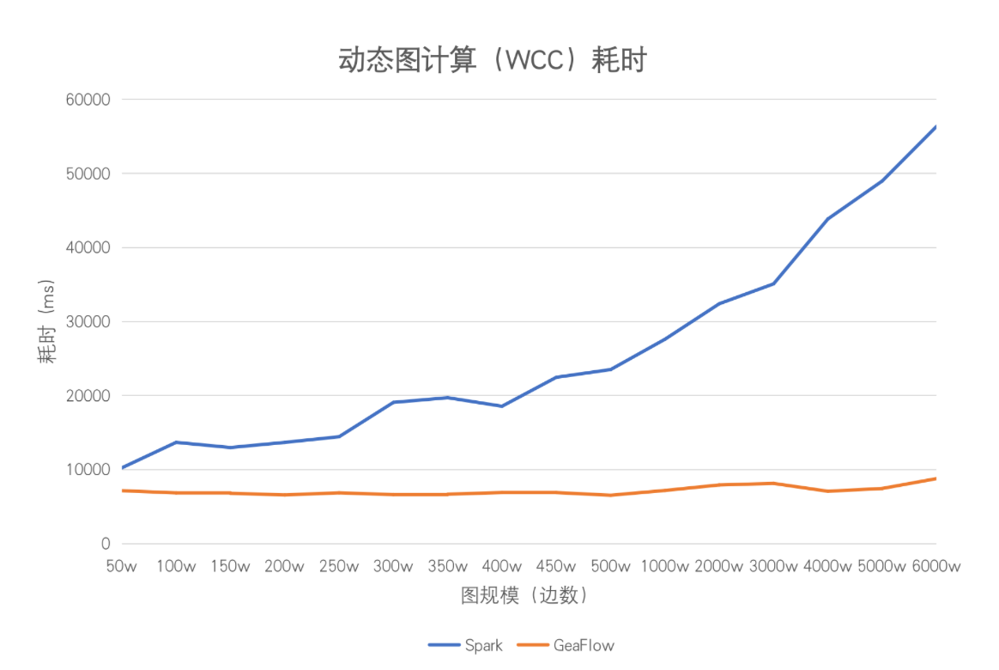
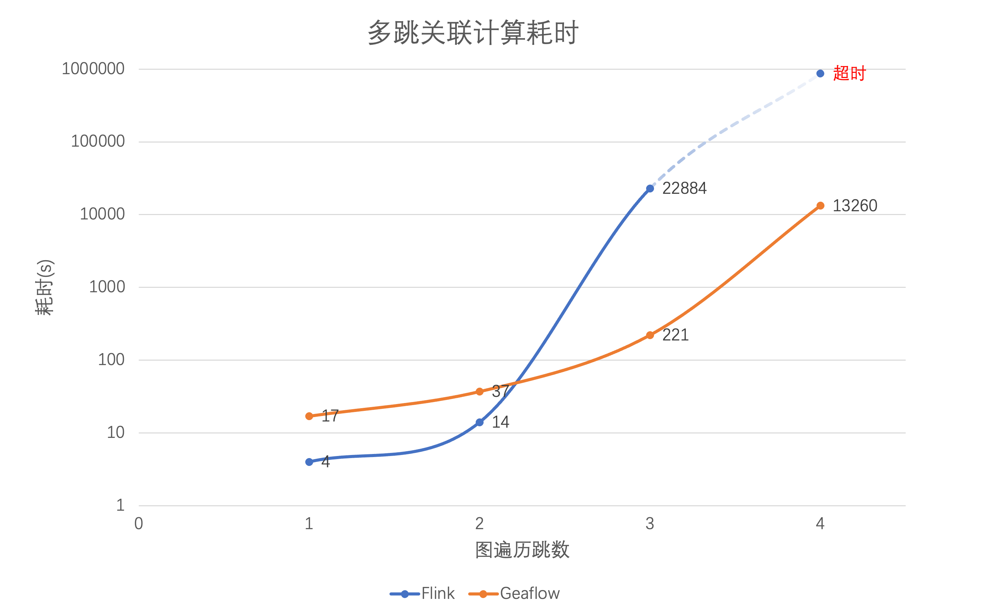

# GeaFlow

<!-- 

 -->

<!--intro-start-->

## 介绍

GeaFlow 是蚂蚁集团开源的流图计算引擎，支持万亿级图存储、图表混合处理、实时图计算、交互式图分析等核心能力，目前广泛应用于数仓加速、金融风控、知识图谱以及社交网络等场景。

关于 GeaFlow 更多介绍请参考：[GeaFlow 介绍文档](2.introduction.md)

GeaFlow 设计论文参考：[GeaFlow: A Graph Extended and Accelerated Dataflow System](https://dl.acm.org/doi/abs/10.1145/3589771)

## 特性

- 分布式实时图计算
- 图表混合处理（SQL+GQL 语言）
- 统一流批图计算
- 万亿级图原生存储
- 交互式图分析
- 高可用和 Exactly Once 语义
- 高阶 API 算子开发
- UDF/图算法/Connector 插件支持
- 一站式图研发平台
- 云原生部署

## 快速上手

第一步 打包 jar 包并提交 quick start 任务

1. 准备 Git、JDK8、Maven、Docker 环境。
2. 下载源码：`git clone https://github.com/TuGraph-family/tugraph-analytics geaflow`
3. 项目构建：`./build.sh --module=geaflow --output=package`
4. 测试任务：`./bin/gql_submit.sh --gql geaflow/geaflow-examples/gql/loop_detection_file_demo.sql`

第二步 启动控制台，体验白屏提交 quick start 任务

5. 构建控制台 jar 和镜像(需启动 Docker)：`./build.sh --module=geaflow-console`
6. 启动控制台：`docker run -d --name geaflow-console -p 8888:8888 geaflow-console:0.1`

更多详细内容请参考：[快速上手文档](3.quick_start/1.quick_start.md)。

## 开发手册

GeaFlow 支持 DSL 和 API 两套编程接口，您既可以通过 GeaFlow 提供的类 SQL 扩展语言 SQL+ISO/GQL 进行流图计算作业的开发，也可以通过 GeaFlow 的高阶 API 编程接口通过 Java 语言进行应用开发。

- DSL 应用开发：[DSL 开发文档](5.application-development/2.dsl/1.overview.md)
- API 应用开发：[API 开发文档](5.application-development/1.api/1.overview.md)

## 性能优势

### 增量图计算

GeaFlow 支持增量图计算的能力，即在动态图（图是不断变化的）上，可以持续进行流式增量的图迭代计算或遍历。当 GeaFlow 消费实时中间件的消息时，当前窗口的实时数据所涉及的点会被激活，从而触发迭代图计算。每一轮迭代仅需将有更新的点通知其邻居节点，未更新的点则不会被触发计算，这显著提升了计算的时效性。

在业界早期，存在 Spark GraphX 分布式离线图计算的系统。为了支持类似的引擎能力，Spark 需要依赖 Spark Streaming 框架。然而，尽管这种融合的方式可以支持流式消费点边数据，每次触发计算时仍需进行全量图计算，这使得计算的时效性很难满足业务预期（这种方式也被称为基于快照的图计算方案）。

以 WCC 算法为例，我们对 GeaFlow 与 Spark 方案的算法耗时进行了比较，具体性能表现如下：

由于 GeaFlow 仅激活当前窗口中涉及的点边进行增量计算，计算时间可以在秒级别内完成，每个窗口的计算时间基本稳定。随着数据量的增加，Spark 在进行计算时需回溯的历史数据也随之增多。在机器容量未达到上限的情况下，其计算延迟与数据量呈正相关分布。在相同情况下，GeaFlow 的计算时间可能会略有增加，但仍可基本保持在秒级别完成。

### 流计算加速

与传统的流式计算引擎（如 Flink、Storm 等基于表模型的实时处理系统）相比，GeaFlow 采用图作为数据模型（点边的存储模式），在处理 Join 关系运算，特别是复杂多跳关系运算（如超过 3 跳的 Join、复杂环路查找）时具备显著的性能优势。

为了进行比较，我们采用 K-Hop 算法分析了 Flink 与 GeaFlow 的性能。K-Hop 关系是指可以通过 K 个中间人相互认识的关系链，例如在社交网络中，K-Hop 指的是通过 K 个中介联系的用户关系。在交易分析中，K-Hop 指的是资金的 K 次连续转移路径。

在 Flink 与 GeaFlow 的 K-Hop 算法耗时对比中：

如上图所示，在一跳和两跳的场景中，Flink 的性能略优于 GeaFlow。这是因为在这些场景中，参与 Join 计算的数据量较小，左表和右表都很小，使得遍历操作耗时短。此外，Flink 的计算框架能够缓存 Join 操作的历史计算结果。

然而，当进入三跳和四跳场景时，计算复杂度的上升导致 Join 算子需要遍历的表迅速膨胀，从而使计算性能大幅下降，甚至在四跳场景中超过一天仍无法完成计算。相比之下，GeaFlow 采用基于流图的增量算法，计算时间仅与增量路径相关，而与历史的关联关系计算结果无关，因此性能明显优于 Flink。

## 参与贡献

非常感谢您参与到 GeaFlow 的贡献中来，无论是 Bug 反馈还是文档完善，或者是大的功能点贡献，我们都表示热烈的欢迎。

具体请参考：[参与贡献文档](9.contribution.md)。

**如果您对 GeaFlow 感兴趣，欢迎给我们项目一颗[ ⭐️ ](https://github.com/TuGraph-family/tugraph-analytics)。**

## 联系我们

您可以通过以下方式联系我们。

| 名称                                                    | 功能         |                                                 |                                                       |                                                               |
| :------------------------------------------------------ | :----------- | :---------------------------------------------- | :---------------------------------------------------- | :------------------------------------------------------------ |
| [dev@geaflow.apache.org](mailto:dev@geaflow.apache.org) | 开发相关讨论 | [订阅](mailto:dev-subscribe@geaflow.apache.org) | [取消订阅](mailto:dev-unsubscribe@geaflow.apache.org) | [归档](http://mail-archives.apache.org/mod_mbox/geaflow-dev/) |

## 致谢

GeaFlow 开发过程中部分模块参考了一些业界优秀的开源项目，包括 Apache Flink、Apache Spark 以及 Apache Calcite 等, 这里表示特别的感谢。也感谢对 GeaFlow 做过贡献的个人开发者，名单如下：

<!--  -->

生成 By [contrib.rocks](https://contrib.rocks).

<!--intro-end-->
